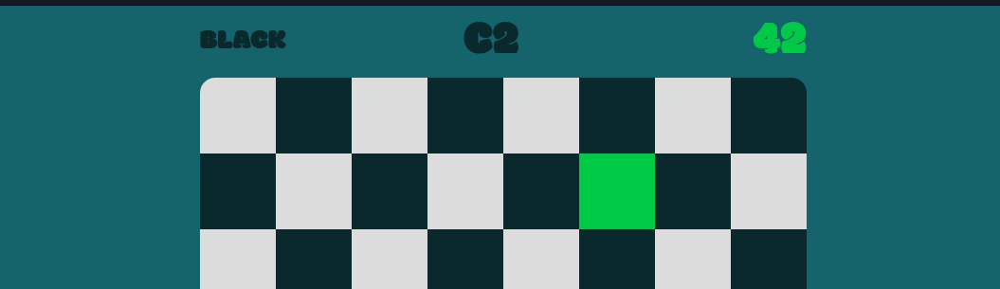

# Chess Board Master

A small chess board coordinates game to help you improve your coordinate notation recognition. You get a coordinate prompt at the top along with the color of your perspective and you must click the correct square. One minute on the clock, how many can you get?

Play it on github at https://cristiandima.github.io/chessboardmaster/
